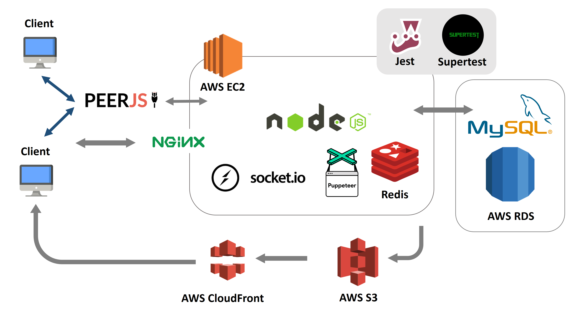
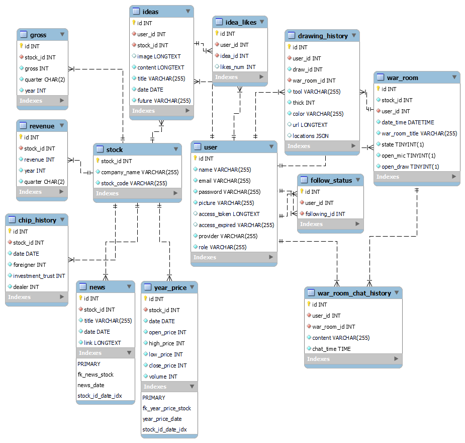

# StoComm

A platform where investors can share their insights to community via real-time voice chat and collaborative whiteboard tool.
Inspired by Tradingview and Stocktwits.

 * [Home page](https://stocomm.site/)
 * [Ideas Explore page](https://stocomm.site/explore)

## Test Account

 * Email: test@mail.com
 * Password: test

*Vistors are only for ideas posts reviewing, please log in to experience complete collaborative features!*

## One-Click Login
Quick fill out login form with demo email and password 

 * [Fast-Login](https://stocomm.site?is_demo=1)

 ---

## Home Page

## Table of Contents
 * [Technologies](#Technologies)
 * [Architecture](#Architecture)
 * [Socket Flowchart](#Socket-Flowchart)
 * [Database Schema](#Database-Schema)
 * [Main Features](#Main-Features)
 * [Contact](#Contact)

## Architecture

## Database Schema

## Features

 * ### Start a room to discuss or share insights

 

 * ### Drawing & Voice permission Control
   * ### Host View
     * ### Hosts can turn on or turn off client's drawing permission
     * ### Hosts can turn on or turn off client's voice permission

   

   * ### Client View
     * ### The drawing tool is hidden when Host turn off drawing permission
     * ### The voice connection is closed when Host mutes all clients

   

 * ### Discuss topics with real-time collaborative drawing tool

 

 * ### Post your idea to community

 

## Technologies
### Back-End
 * **Runtime:** Node,js
 * **Framework:** Express
 * **Server OS:** Linux
 * **Server-side Render:** Handlebars

### Front-End
 * **Framework:** Bootstrap
 * **Chart Library:** Anycahrt
 * **Drawing Library:** Konva

### WebSocket
 * Socket.IO

### WebRTC
 * PeerJS

### Cloud Service (AWS)
 * EC2
 * S3 + CloudFront
 * RDS

### Database
 * MySQL
 * Redis

### Networking 
 * Nginx

### Test
 * Jest
 * Supertest

## Contact

 * [LinkedIn](https://www.linkedin.com/in/hsin-ping-k/)
 * Email: slammingthebasket123@gmail.com